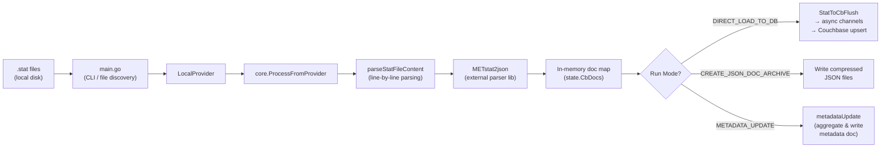
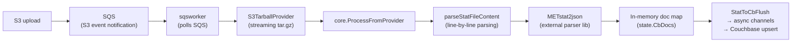
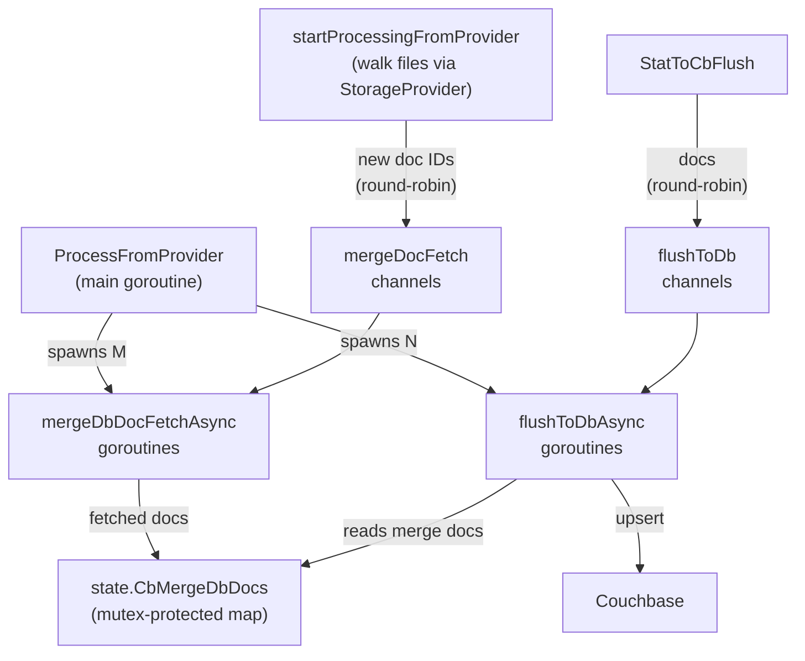

# METjson2db Architecture Overview

## Purpose

METjson2db is a Go tool that converts MET (Model Evaluation Tools) `.stat` files into JSON documents and loads them into a Couchbase database. It is part of the DTC (Developmental Testbed Center) verification ecosystem and serves as the ETL pipeline between MET output and the Couchbase document store used by downstream applications like METexpress.

The tool supports two entrypoints: a **CLI** for processing local stat files, and an **SQS worker** that reacts to S3 event notifications and streams tarballs of stat files directly from S3 without writing them to disk. Both entrypoints share a common processing pipeline via the `StorageProvider` interface.

## High-Level Data Flow

### CLI Path (local files)



### SQS Worker Path (S3 tarballs)



The `S3TarballProvider` streams the tarball via `s3.GetObject`, pipes it through `gzip.NewReader` → `tar.NewReader`, and yields each `.stat` entry to the parser without writing anything to disk.

## Package Layout

```
METjson2db/
├── cmd/metjson2db/         # CLI entry point
│   ├── main.go             # CLI flags, file discovery, orchestration
│   └── main_test.go        # Unit test for load_spec parsing
├── cmd/sqsworker/          # SQS worker entry point
│   └── main.go             # Polls SQS, processes S3 tarballs
├── pkg/
│   ├── core/               # Core processing pipeline
│   │   ├── processInput.go            # Orchestrator — sets up workers, drives pipeline
│   │   ├── statFileToCbDocMetParser.go # Per-file parsing via METstat2json
│   │   ├── statToCbRun.go             # File iteration and status tracking
│   │   └── statToCbFlush.go           # Flush docs to Couchbase or disk
│   ├── storage/            # StorageProvider interface and implementations
│   │   ├── provider.go               # StorageProvider interface
│   │   ├── local.go                   # LocalProvider — reads from local filesystem
│   │   ├── s3tarball.go               # S3TarballProvider — streams tar.gz from S3
│   │   └── s3event.go                 # S3 event notification JSON parser
│   ├── async/              # Concurrent DB workers
│   │   ├── flushToDbAsync.go          # Channel-fed goroutine: upsert + merge
│   │   └── mergeDbDocFetchAsync.go    # Channel-fed goroutine: fetch existing docs
│   ├── state/              # Global shared mutable state
│   │   └── sharedState.go             # Package-level vars, mutexes, channels
│   ├── types/              # Data structures
│   │   └── dataStructures.go          # LoadSpec, Credentials, CbConnection, etc.
│   ├── utils/              # Utility functions
│   │   ├── db-utils.go                # Couchbase connection + query helpers
│   │   ├── statToCbUtils.go           # Date conversion
│   │   └── utils.go                   # JSON formatting, GUID generation
│   ├── metadataUpdate/     # Metadata aggregation mode
│   │   ├── metadataUpdate.go          # Builds metadata doc from DB queries
│   │   └── templateQueries.go         # SQL template loading and execution
│   └── black_box_tests/    # Integration tests (build-tagged)
│       └── merge_test.go             # DB merge round-trip test
├── load_spec.json          # Runtime configuration (run mode, threading, folders)
├── credentials.template    # Couchbase connection credentials template (YAML)
├── Dockerfile              # Multi-stage distroless container build
├── indexes/                # Couchbase index creation SQL
├── sqlTemplates/           # Parameterized SQL++ query templates
├── SQLs/                   # Ad-hoc / debug SQL++ queries
└── test_data/              # Sample .stat files for testing
```

## Critical Files

| File                                                                            | Role                                                                                                                                                                                                      |
| ------------------------------------------------------------------------------- | --------------------------------------------------------------------------------------------------------------------------------------------------------------------------------------------------------- |
| [cmd/metjson2db/main.go](../cmd/metjson2db/main.go)                             | CLI entry point. Parses CLI flags (`-c`, `-l`, `-m`, `-f`, `-i`, `-I`, `-r`, `-d`), resolves input files, creates a `LocalProvider`, and calls `core.ProcessFromProvider`.                 |
| [cmd/sqsworker/main.go](../cmd/sqsworker/main.go)                               | SQS worker entry point. Polls SQS for S3 event notifications, creates an `S3TarballProvider` for each tarball, and runs it through `core.ProcessFromProvider`.                             |
| [pkg/storage/provider.go](../pkg/storage/provider.go)                           | Defines the `StorageProvider` interface — the abstraction that unifies local and S3 file access behind a single `Walk(ctx, fn)` method.                                                    |
| [pkg/storage/local.go](../pkg/storage/local.go)                                 | `LocalProvider` — implements `StorageProvider` by opening files from the local filesystem.                                                                                                  |
| [pkg/storage/s3tarball.go](../pkg/storage/s3tarball.go)                         | `S3TarballProvider` — implements `StorageProvider` by streaming a tar.gz from S3 and yielding `.stat` entries without disk I/O.                                                            |
| [pkg/storage/s3event.go](../pkg/storage/s3event.go)                             | Parses S3 event notification JSON (the format SQS receives when S3 triggers a notification).                                                                                                |
| [pkg/core/processInput.go](../pkg/core/processInput.go)                         | **Pipeline orchestrator.** `ProcessFromProvider` sets up async DB-upload and merge-fetch goroutines, walks files via a `StorageProvider`, flushes, and reports run stats. `ProcessInputFiles` is a backward-compatible wrapper. Also contains `GetCredentials` and `ParseLoadSpec`. |
| [pkg/core/statFileToCbDocMetParser.go](../pkg/core/statFileToCbDocMetParser.go) | `parseStatFileContent` reads stat file content from an `io.Reader`, splits into header + data lines, and calls `METstat2json/parser.ParseLine` for each line. `statFileToCbDocMetParser` is a thin wrapper that opens a local file and delegates.                    |
| [pkg/core/statToCbRun.go](../pkg/core/statToCbRun.go)                           | `startProcessingFromProvider` (unexported) walks files via a `StorageProvider` and calls `parseStatFileContent` for each. Tracks file status. Called by `ProcessFromProvider` during the core parsing phase.        |
| [pkg/core/statToCbFlush.go](../pkg/core/statToCbFlush.go)                       | Distributes in-memory docs to async upload channels (round-robin) or writes them to disk.                                                                                                                 |
| [pkg/async/flushToDbAsync.go](../pkg/async/flushToDbAsync.go)                   | Goroutine worker that reads docs from a channel, optionally merges with existing DB docs, and upserts to Couchbase.                                                                                       |
| [pkg/state/sharedState.go](../pkg/state/sharedState.go)                         | Global mutable state: in-memory doc maps, mutexes, async channels, wait groups. Initialized via `init()`.                                                                                                 |
| [pkg/types/dataStructures.go](../pkg/types/dataStructures.go)                   | All shared types: `LoadSpec`, `Credentials`, `CbConnection`, `Metadata` hierarchy, `StatToCbRun`.                                                                                                         |
| [load_spec.json](../load_spec.json)                                             | Runtime configuration: run mode, thread counts, channel buffer sizes, folder templates with field substitution, dataset name, log level.                                                                  |
| [credentials.template](../credentials.template)                                 | Template for `~/credentials` YAML file containing Couchbase host, user, password, bucket, scope, collection.                                                                                              |

## Run Modes

| Mode                      | Description                                                                                                                  |
| ------------------------- | ---------------------------------------------------------------------------------------------------------------------------- |
| `DIRECT_LOAD_TO_DB`       | Parse stat files and upsert documents directly into Couchbase. Supports merge (when `overWriteData: false`).                 |
| `CREATE_JSON_DOC_ARCHIVE` | Parse stat files and write documents to compressed JSON files on disk. No DB connection required.                            |
| `METADATA_UPDATE`         | Query existing data in Couchbase and build/update an aggregated metadata document for METexpress. No stat file input needed. |

## Concurrency Model

The async pipeline uses Go channels and goroutines in a fan-out pattern:



- **`threadsDbUpload`** (default 32): Number of concurrent DB upload goroutines.
- **`threadsMergeDocFetch`** (default 4): Number of concurrent merge-doc-fetch goroutines.
- **`channelBufferSizeNumberOfDocs`** (default 1024): Buffered channel capacity.
- End-of-stream signaled via sentinel "endMarker" values on channels.
- Shared maps (`CbDocs`, `CbMergeDbDocs`, `DocKeyCountMap`) protected by `sync.RWMutex`.

## Key External Dependencies

**[`github.com/dtcenter/METstat2json`](https://github.com/dtcenter/METstat2json)** — The stat file parser library. It defines line-type schemas for each MET version and produces the document structure. METjson2db delegates all parsing to `parser.ParseLine()` and uses `parser.WriteJsonToCompressedFile()` for archive mode.

**[`github.com/aws/aws-sdk-go-v2`](https://github.com/aws/aws-sdk-go-v2)** — AWS SDK for Go (v2). Used by `S3TarballProvider` to stream tarballs from S3, and by the SQS worker to poll for messages. Authentication uses the default credential chain (environment variables, IAM roles, shared credentials file).

## Configuration

### `load_spec.json`

Controls runtime behavior. Key fields:

| Field                  | Purpose                                                              |
| ---------------------- | -------------------------------------------------------------------- |
| `runMode`              | `DIRECT_LOAD_TO_DB`, `CREATE_JSON_DOC_ARCHIVE`, or `METADATA_UPDATE` |
| `targetCollection`     | Override Couchbase collection from credentials                       |
| `datasetName`          | Dataset label (max 10 chars), becomes part of document IDs           |
| `overWriteData`        | `true` = upsert (replace), `false` = merge with existing             |
| `threadsDbUpload`      | Goroutine count for DB writes                                        |
| `threadsMergeDocFetch` | Goroutine count for merge-doc fetching                               |
| `folderTmpl`           | Path template with `{field_name}` placeholders                       |
| `loadVal.field[]`      | Values to substitute into `folderTmpl`                               |
| `logLevel`             | `DEBUG`, `INFO`, `WARN`, `ERROR`                                     |

### `~/credentials` (YAML)

```yaml
cb_host: couchbase://hostname
cb_user: username
cb_password: ***
cb_bucket: metplusdata
cb_scope: _default
cb_collection: MET_default
```

### CLI Flags

| Flag | Default            | Purpose                           |
| ---- | ------------------ | --------------------------------- |
| `-c` | `~/credentials`    | Path to credentials file          |
| `-l` | `./load_spec.json` | Path to load_spec                 |
| `-m` | (from load_spec)   | Run mode override                 |
| `-f` | —                  | Single stat file path             |
| `-i` | —                  | Input folder (non-recursive)      |
| `-I` | —                  | Input folder (recursive)          |
| `-r` | —                  | Filename regex filter (with `-I`) |
| `-d` | —                  | Dataset name override             |

## Couchbase Document Model

MET stat data is stored as JSON documents with:

- **Header fields** at the top level (model, threshold, region, etc.)
- **Data fields** nested under a `"data"` key, keyed by forecast lead time or object ID
- **Document ID** constructed from header fields to enable deterministic merge

## Dev Practices & Go Alignment Notes

### What the codebase does well

- **Standard project layout**: `cmd/` for the binary entry point, `pkg/` for library packages.
- **Multi-stage Docker build** with distroless base and non-root user.
- **Build-tagged integration tests** (`//go:build integration`) separate from unit tests.
- **Structured logging** via `log/slog` with JSON output and configurable levels.
- **External config** kept out of the binary (credentials file, load_spec.json).

### Opportunities to align with Go best practices

1. **Global mutable state (`pkg/state`)**: The `state` package uses package-level variables with mutexes. This is the biggest architectural concern — it makes testing difficult, prevents running multiple pipelines concurrently, and creates hidden coupling. The Go-idiomatic approach is to pass a context/config struct through function parameters or use a top-level `App`/`Pipeline` struct that owns the state.

2. **`init()` functions**: Nearly every package has an `init()` function, most of which only log a debug message. `init()` should be reserved for truly unavoidable package-level setup. Remove the no-op debug inits; move real initialization to explicit constructors.

3. **Error handling**: Several functions log errors but continue execution (e.g., `GetDbConnection` returns a zero-value `CbConnection` on error). Functions should return errors to callers and let the caller decide how to handle them. Avoid `log.Fatal` in library code.

4. **DB connection per call**: `GetDbConnection()` creates a new Couchbase cluster connection each time it's called (including inside each async goroutine). Couchbase SDK connections are meant to be long-lived and shared. Create one connection at startup and pass it through.

5. **Naming conventions**: Some names don't follow Go conventions:
   - `processInput.go` ✓ (renamed)
   - `statToCbUtils.go` → Merge into the package it serves or name by domain
   - `Cb_host`, `Cb_user` → `CbHost`, `CbUser` (Go exported fields use CamelCase, not snake_case)
   - Unexported types like `StrArray` are duplicated across packages

6. **Context propagation**: `ProcessFromProvider` and the `StorageProvider` interface accept `context.Context`, enabling graceful cancellation for the SQS worker path. The rest of the pipeline (async workers, DB calls) does not yet propagate context.

7. **Test coverage**: One unit test (`TestParseLoadSpec`) and one integration test (`TestMerge`) for the core pipeline. The `pkg/storage/` package has 90%+ unit test coverage and an integration test against MiniStack. See [docs/dev-guide.md](dev-guide.md) for how to run tests.

8. **Mixed logging**: `metadataUpdate` uses `log.Print`/`log.Fatal` while the rest uses `slog`. Standardize on `slog`.

9. **SQL template injection**: `templateQueries.go` does string replacement for SQL parameters. While these are internal values (not user input), using parameterized queries is safer and more maintainable.

10. **File path handling**: Manual string concatenation for paths (`inputFolder+file.Name()`) should use `filepath.Join()` for correctness across platforms.
